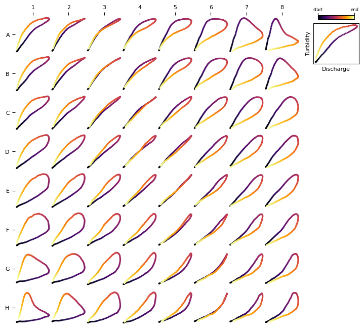

Quickstart
===========

Here's a minimal working example of using HySOM for training and visualizing an SOM 

.. code-block:: python

   from hysom import HSOM
   from hysom.utils.datasets import get_labeled_loops
   from hysom.utils.plots import plot_map

   # Get sample data
   loops, _ = get_labeled_loops()

   # Train SOM
   som = HSOM(width=8, height=8, input_dim = loops.shape[1:])
   som.train(loops, epochs = 5)

   # Visualize results
   prototypes = som.get_prototypes()
   _ = plot_map(prototypes)
   
